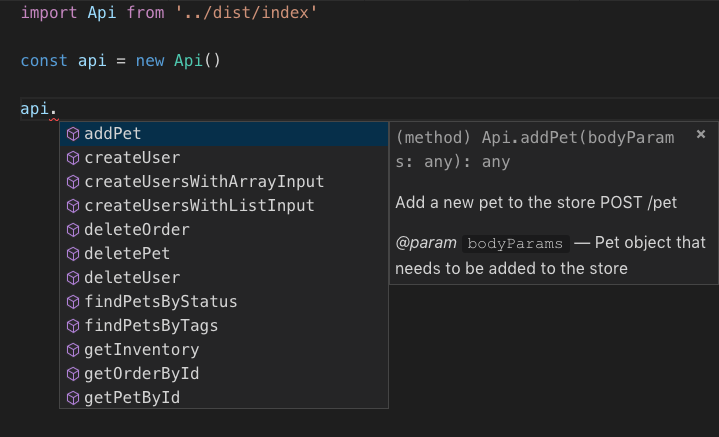
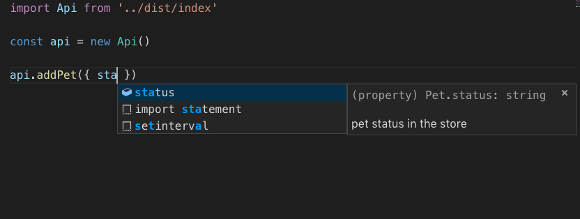
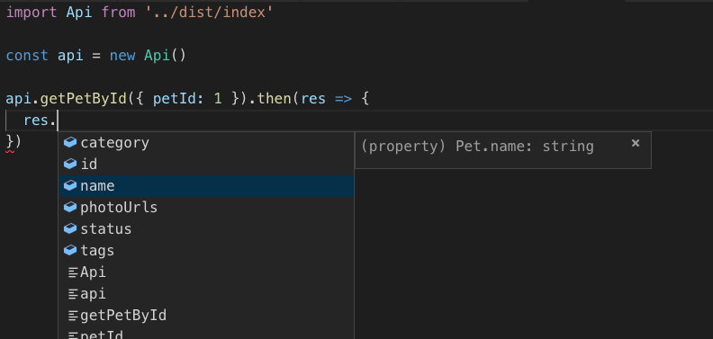

# sisyphus-cli(西西弗斯)

一个从swagger自动生成ts,js代码的工具

## 为什么要使用这个？

1. 减少模板代码
2. 接口的版本控制 
3. 请求参数和返回结果的自动提示 
4. 自动生成文档和注释

接口文档和参数



请求参数和注释



返回参数和注释



# 如何使用

## 安装cli

`npm install sisyphus-cli -g`

## 如何增加新的项目

1. 新建文件夹如`xxx-api`
2. `sisyphus init xxx-api`初始化
3. 查看如何更新代码

## 如何更新代码

1. 进入相应文件夹如`xxx-api`
2. 查看`sisyphus.json`文件file路径是否执行对应swagger的地址
3. 执行`sisyphus`生成ts
4. 执行`npm run build`生成js

# sisyphus
```json
{
	"file": "http://localhost:8000/v2/api-docs", 
	"generic": ["PageOutput", "ResultMessage"],
  "tags": {
  	"信息相关": "message",
  }
}
```

`file` 表示swagger地址，可以是url或者file
`generic` 表示泛型类，需要手动编写放在model文件。不填写generic，会将`Page<Data>` => `PageData`类型
`tags` 表示tag映射，如果tag是中文的最好映射一下

# QA

Q: 我遇到了中文的model怎么办？
> A: 修改java中的注解，`@ApiModel("xxx")` => `@ApiModel(description = "xxx")`

# TODO

* [x] 生成model代码
* [x] 生成api代码
* [x] 优化注释
* [x] 自动打包发布到npm，包含可以提示的d.ts
* [ ] 自动生成浏览器可以用的js
* [ ] 考虑泛型的优化
